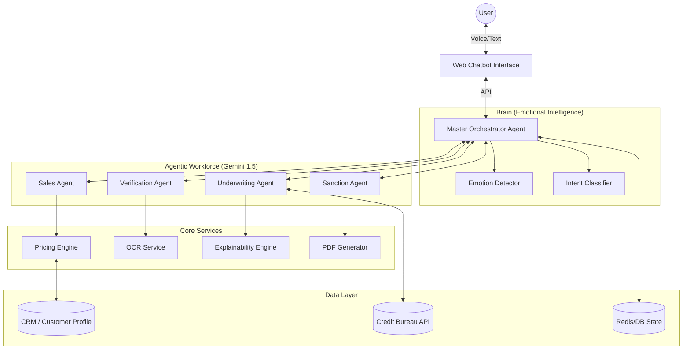

# Tata Capital IntelliApprove

**An agentic AI lending platform that transforms loan applications from static forms into dynamic, explainable conversations.**

---

## Executive Summary

### 1️⃣ Problem (Why Tata Capital needs this)
The current digital lending process is broken. It is rigid, impersonal, and opaque. Customers face lengthy forms, "black box" rejections without explanation, and zero guidance when they get stuck. For Tata Capital, this leads to high drop-off rates (often >70%), operational bottlenecks, and a transactional relationship that fails to build long-term loyalty.

### 2️⃣ Your Solution (What our AI agentic system does)
**IntelliApprove** is a next-generation **Agentic AI Lending Platform** that reimagines lending as a seamless, transparent conversation. It is not just a chatbot; it is a team of specialized AI agents working in unison. It acts as a 24/7 financial advisor that understands **emotion**, explains **decisions**, and **gamifies** the journey—ensuring every customer feels heard, understood, and valued.

### 3️⃣ How it works (High-level)
The system is powered by a **Master Orchestrator** that dynamically coordinates specialized LLM-powered agents (running on a local Ollama model):
*   **Sales Agent:** Engages the user and discovers needs.
*   **Verification Agent:** Instantly extracts data from uploaded documents (e.g., salary slips) using OCR.
*   **Pricing Engine:** Calculates personalized interest rates in real-time based on loyalty and risk.
*   **Underwriting Agent:** Assesses creditworthiness instantly with Explainable AI.
*   **Sanction Agent:** Generates and delivers a legally binding sanction letter in seconds.

### 4️⃣ Why it is innovative
*   **Explainable AI (XAI):** Unlike "black box" systems, we provide plain-English explanations for every decision (e.g., "High Debt-to-Income Ratio"), building immense trust.
*   **Emotional Intelligence:** The system detects user sentiment in real-time and adapts its tone.
*   **Gamification Engine:** Users earn badges (e.g., "Deal Closer") for financial responsibility, turning a boring process into an engaging achievement.
*   **Agentic Workflow:** Non-linear, natural conversations driven by user intent, not hardcoded trees.

### 5️⃣ Impact / Results
*   **Speed:** Reduces "Application to Sanction" time from days to **<5 minutes**.
*   **Conversion:** XAI and Gamification reduce drop-offs by turning rejections into "not yet" guidance.
*   **Efficiency:** Automates 90% of underwriting and verification tasks.

---

## System Architecture



### ASCII Architecture View

```text
┌─────────────────────────────────────────────────────────────────────────┐
│                    WEB CHATBOT INTERFACE (Multi-Language)               │
│  Voice Input (Hindi/Tamil/Telugu/Bengali/Marathi) + Text                │
│  Emotion Indicators 😊😟😠 | Explainability Panel | Gamification Bar    │
└────────────────────┬────────────────────────────────────────────────────┘
                     │
                     ▼
┌─────────────────────────────────────────────────────────────────────────┐
│              MASTER AGENT (Enhanced AI Orchestrator)                    │
│  ┌──────────────────────────────────────────────────────────────────┐   │
│  │ EMOTIONAL INTELLIGENCE LAYER                                    │   │
│  │  • Real-time sentiment analysis                                  │   │
│  │  • Tone adaptation engine                                        │   │
│  │  • Empathy response generator                                    │   │
│  └──────────────────────────────────────────────────────────────────┘   │
│                                                                         │
│  Core Components:                                                       │
│  • LLM: Local Ollama model (configurable)                               │
│  • Orchestration: Custom State Machine                                  │
│  • Memory: SQL + Vector Context                                         │
│  • Voice: Browser Speech API + TTS                                      │
└──┬────────┬────────┬────────┬───────────────────────────────────────────┘
   │        │        │        │
   ▼        ▼        ▼        ▼
┌─────┐ ┌─────┐ ┌─────┐ ┌─────────────┐
│Sales│ │Verif│ │Under│ │Sanction     │
│Agent│ │Agent│ │write│ │Letter Gen   │
│  +  │ │     │ │Agent│ │    +        │
│Dyna-│ │     │ │  +  │ │Gamifi-      │
│mic  │ │     │ │Explai│ │cation      │
│Price│ │     │ │nable│ │             │
└──┬──┘ └──┬──┘ └──┬──┘ └──────┬──────┘
   │        │        │           │
   ▼        ▼        ▼           ▼
┌────────────────────────────────────────────────────────────────┐
│                  ENHANCED DATA & API LAYER                     │
│  • Offer Mart Server (Real-time Dynamic Pricing)               │
│  • CRM Server (Customer Profile + Emotion History)             │
│  • Credit Bureau API (Mock)                                    │
│  • Emotion AI API (Sentiment Analysis)                         │
│  • Explainability Engine                                       │
│  • Gamification Service (Points, Levels, Rewards)              │
└────────────────────────────────────────────────────────────────┘
```

---

## Tech Stack

| Component | Technology |
|-----------|------------|
| **Frontend** | React, TypeScript, Vite, Tailwind CSS, Shadcn UI |
| **Backend** | Python 3.10+, FastAPI, Uvicorn |
| **AI / LLM** | Local Ollama models (HTTP API) |
| **Orchestration** | Custom agentic state machine (Python) |
| **Database** | SQLite (Dev) / PostgreSQL (Prod), SQLAlchemy ORM |
| **Infrastructure** | Local / containerised deployment, optional cloud backing services |

---

## Getting Started

### Prerequisites
*   Python 3.10+
*   Node.js & npm
*   Ollama installed and running locally (with at least one model pulled, e.g. `llama3`)

### 1. Backend Setup
```bash
cd backend
# Create virtual environment (optional but recommended)
python -m venv venv
# Windows: venv\Scripts\activate
# Mac/Linux: source venv/bin/activate

# Install dependencies
pip install -r requirements.txt

# Configure Environment
# Create a .env file in backend/ and add, for example:
# OLLAMA_BASE_URL=http://localhost:11434
# OLLAMA_MODEL_DEFAULT=llama3
# ENVIRONMENT=local

# Run the Server (manual mode)
uvicorn app.main:app --reload
```
*Backend runs on `http://localhost:8000`*

On Windows, you can instead run the helper batch script from the repo root:

```bat
run_servers.bat
```

This starts both the mock servers and the FastAPI backend in separate terminals.

### 2. Frontend Setup
```bash
cd frontend
# Install dependencies
npm install

# Run the Development Server
npm run dev
```
*Frontend runs on `http://localhost:5173`*

---

## Testing the Flow
1.  Open the frontend.
2.  **Sales:** Type "I need a personal loan of 5 lakhs".
3.  **Verification:** The agent will ask for verification (simulated OTP).
4.  **Upload:** Upload a sample salary slip image.
5.  **Underwriting:** The agent will analyze the doc and credit score.
6.  **Sanction:** Receive your instant sanction letter!

---

This implementation is suitable for local demos, hackathons, and internal evaluations, and can be extended to call real services in a production environment.
